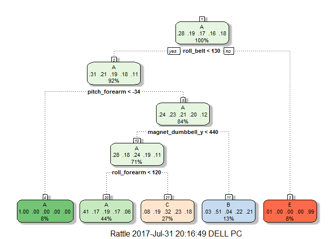

# Practical Machine Learning Course Project
Aniruddha Chakraborty  


# Weight Lifting Exercise Prediction

## **Synopsis**

Using devices such as **Jawbone Up, Nike FuelBand, and Fitbit** it is now possible to collect a large amount of data about personal activity relatively inexpensively. These type of devices are part of the quantified self movement - a group of enthusiasts who take measurements about themselves regularly to improve their health, to find patterns in their behavior, or because they are tech geeks.

In this project, we are given with data from accelerometers on the belt, forearm, arm, and dumbell of 6 participants.They were asked to perform barbell lifts correctly and incorrectly in 5 different ways.**The goal of this project is to predict the manner in which they did the exercise. This is the "classe" variable in the training set.**

Following instructions have been given for the assignment -

1. Any of the other variables may be used to predict.

2. Report should describe -
a) How the model was built?
b) How cross validation was used?
c) What is the expected out of sample error?
d) Explaination about the choices made.

3. Prediction model should be used to predict 20 different test cases.

**We will build 3 models in this project using different Machine Learning Algorithms and cross validation and finally select the one with the least out of sample error. The best model will be used to predict different test cases.**

## **Data Processing**

### **1. Loading the data**

The data for this project come from this source: http://groupware.les.inf.puc-rio.br/har. Let us download the datasets and load them through read.csv into train and test data frames. We will treat all the blank values, "NA", and "#DIV/0!" in the variables as NA. 

```r
## Download the csv files
if (!file.exists("pml-training.csv")) {
    download.file("https://d396qusza40orc.cloudfront.net/predmachlearn/pml-training.csv", 
        destfile = "pml-training.csv")
}
if (!file.exists("pml-testing.csv")) {
    download.file("https://d396qusza40orc.cloudfront.net/predmachlearn/pml-testing.csv", 
        destfile = "pml-testing.csv")
}
## Load the train and test datsets
train <- read.csv("pml-training.csv", header = TRUE, na.strings = c("", 
    "NA", "#DIV/0!"))
test <- read.csv("pml-testing.csv", header = TRUE, na.strings = c("", "NA", 
    "#DIV/0!"))
```

### **2. Preprocessing the data**

We won't be able to run the Machine Learning Algorithms if there are NA values in the variables. Either we have to impute such values or remove the variables having high proportion of NA's from our analysis.

Let us check the proportion of NA's for each variable.


```r
NAProp <- round(colMeans(is.na(train)), 2)
table(NAProp)
```

```
## NAProp
##    0 0.98    1 
##   60   94    6
```

**We can see from the above table that only 60 variables don't have any NA values. We will surely use these variables/features in the Machine Learning Algorithms.** Since, the remaining 100 variables have more than 98% of the values as NA, they won't help in building the prediction algorithms at all, so we can remove them from our analysis. 


```r
## Find the index of the 60 variables with 0% NA Values
keep <- which(NAProp == 0)

## Subset the train and test datasets
train <- train[, keep]
test <- test[, keep]

## Let us look at the first few variables
str(train[, 1:15])
```

```
## 'data.frame':	19622 obs. of  15 variables:
##  $ X                   : int  1 2 3 4 5 6 7 8 9 10 ...
##  $ user_name           : Factor w/ 6 levels "adelmo","carlitos",..: 2 2 2 2 2 2 2 2 2 2 ...
##  $ raw_timestamp_part_1: int  1323084231 1323084231 1323084231 1323084232 1323084232 1323084232 1323084232 1323084232 1323084232 1323084232 ...
##  $ raw_timestamp_part_2: int  788290 808298 820366 120339 196328 304277 368296 440390 484323 484434 ...
##  $ cvtd_timestamp      : Factor w/ 20 levels "02/12/2011 13:32",..: 9 9 9 9 9 9 9 9 9 9 ...
##  $ new_window          : Factor w/ 2 levels "no","yes": 1 1 1 1 1 1 1 1 1 1 ...
##  $ num_window          : int  11 11 11 12 12 12 12 12 12 12 ...
##  $ roll_belt           : num  1.41 1.41 1.42 1.48 1.48 1.45 1.42 1.42 1.43 1.45 ...
##  $ pitch_belt          : num  8.07 8.07 8.07 8.05 8.07 8.06 8.09 8.13 8.16 8.17 ...
##  $ yaw_belt            : num  -94.4 -94.4 -94.4 -94.4 -94.4 -94.4 -94.4 -94.4 -94.4 -94.4 ...
##  $ total_accel_belt    : int  3 3 3 3 3 3 3 3 3 3 ...
##  $ gyros_belt_x        : num  0 0.02 0 0.02 0.02 0.02 0.02 0.02 0.02 0.03 ...
##  $ gyros_belt_y        : num  0 0 0 0 0.02 0 0 0 0 0 ...
##  $ gyros_belt_z        : num  -0.02 -0.02 -0.02 -0.03 -0.02 -0.02 -0.02 -0.02 -0.02 0 ...
##  $ accel_belt_x        : int  -21 -22 -20 -22 -21 -21 -22 -22 -20 -21 ...
```

**We can see that the first 7 variables are not related to the data from accelerometers on the Belt, arm, dumbbell, and forearm of partcipants.** These variables are Row number, user_name, raw_timestamp_part_1, raw_timestamp_part_2, cvtd_timestamp, new_window, num_window and they are not going to help us to predict the manner in which participants did the exercise. So, we can safely exclude these variables from our analysis.


```r
## Remove unwanted variables
train <- train[, -(1:7)]
test <- test[, -(1:7)]

## Following predictors will be used to predict the outcome variable -
## 'classe'
names(train[, -53])
```

```
##  [1] "roll_belt"            "pitch_belt"           "yaw_belt"            
##  [4] "total_accel_belt"     "gyros_belt_x"         "gyros_belt_y"        
##  [7] "gyros_belt_z"         "accel_belt_x"         "accel_belt_y"        
## [10] "accel_belt_z"         "magnet_belt_x"        "magnet_belt_y"       
## [13] "magnet_belt_z"        "roll_arm"             "pitch_arm"           
## [16] "yaw_arm"              "total_accel_arm"      "gyros_arm_x"         
## [19] "gyros_arm_y"          "gyros_arm_z"          "accel_arm_x"         
## [22] "accel_arm_y"          "accel_arm_z"          "magnet_arm_x"        
## [25] "magnet_arm_y"         "magnet_arm_z"         "roll_dumbbell"       
## [28] "pitch_dumbbell"       "yaw_dumbbell"         "total_accel_dumbbell"
## [31] "gyros_dumbbell_x"     "gyros_dumbbell_y"     "gyros_dumbbell_z"    
## [34] "accel_dumbbell_x"     "accel_dumbbell_y"     "accel_dumbbell_z"    
## [37] "magnet_dumbbell_x"    "magnet_dumbbell_y"    "magnet_dumbbell_z"   
## [40] "roll_forearm"         "pitch_forearm"        "yaw_forearm"         
## [43] "total_accel_forearm"  "gyros_forearm_x"      "gyros_forearm_y"     
## [46] "gyros_forearm_z"      "accel_forearm_x"      "accel_forearm_y"     
## [49] "accel_forearm_z"      "magnet_forearm_x"     "magnet_forearm_y"    
## [52] "magnet_forearm_z"
```

**Let us check the near zero variance of the covariates**, to identify those variables which have very little variability and will not be good predictors.


```r
library(caret)
nzv <- nearZeroVar(train)
nzv
```

```
## integer(0)
```

**So, there are no variables with Near Zero Variance.**

### **3. Data Partitioning**

We will be predicting the outcome variable with our best model on the test dataset, which has only 20 observations. **Let us split our train dataset into Training and Probe datasets in the ratio 60:40.** Testing our model(s) on the Probe dataset will help us get an estimate of out of sample error.


```r
set.seed(2017)
inTrain <- createDataPartition(train$classe, p = 0.6, list = FALSE)
Training <- train[inTrain, ]
Probe <- train[-inTrain, ]

## Let us look at the dimensions of Training, Probe and Test datasets
dim(Training)
```

```
## [1] 11776    53
```

```r
dim(Probe)
```

```
## [1] 7846   53
```

```r
dim(test)
```

```
## [1] 20 53
```

## **Building Models using Machine Learning Algorithms**

**We will build 3 models in this project using different Machine Learning Algorithms and cross validation and finally select the one with the least out of sample error. The best model will be used to predict different test cases.** 

The following classification models will be used to predict the 'classe' outcome variable -

1. Classification and Regression Trees(CART) built using rpart package.
2. Random forest model built using randomForest package
3. Boosting with trees built using gbm.

### Cross Validation

Cross validation is done for all the models with number of times to do cross validation or K set as 3. We will use the train function of caret package to fit the models. Let us configure trainControl() object for k-fold cross validation with 3 folds.


```r
## Add additional argument for Random Forest for alowing parallel
## processing - allowParallel=TRUE
TC <- trainControl(method = "cv", number = 3, classProbs = TRUE, allowParallel = TRUE)
```

### Fit the models
Let us now use the train function of caret package to fit the models.


```r
set.seed(999)
## 1. Build CART model
library(rpart)
library(rattle)
modelCART <- train(classe ~ ., data = Training, trControl = TC, method = "rpart")

## 2. Build Random Forest Model
library(randomForest)
modelRF <- train(classe ~ ., method = "rf", data = Training, trControl = TC)

## 3. Build Boosting with trees model with gbm
library(gbm)
modelGBM <- train(classe ~ ., data = Training, trControl = TC, method = "gbm", 
    verbose = FALSE)
```

## **Evaluating the Models**

### In Sample Error Rates

1. **CART Model**


```r
## Print the model parameters like cp, Accuracy
print(modelCART)
```

```
## CART 
## 
## 11776 samples
##    52 predictor
##     5 classes: 'A', 'B', 'C', 'D', 'E' 
## 
## No pre-processing
## Resampling: Cross-Validated (3 fold) 
## Summary of sample sizes: 7851, 7851, 7850 
## Resampling results across tuning parameters:
## 
##   cp          Accuracy   Kappa    
##   0.03595159  0.4973682  0.3440209
##   0.05841639  0.4905742  0.3348410
##   0.11343142  0.3651494  0.1233019
## 
## Accuracy was used to select the optimal model using  the largest value.
## The final value used for the model was cp = 0.03595159.
```

```r
## Plot the final tree
fancyRpartPlot(modelCART$finalModel)
```

<!-- -->

**We can see that In Sample Error Rate (1-Accuracy) is about 50.26%, which is quite high.** But the final CART model is quite interpretable and we can see that roll_belt, pitch_forearm, magnet_dumbell and roll_forearm variables have been used to spilt. The final value used for the model was cp = 0.0359516.

2. **Random Forest Model**


```r
## Print the model parameters
print(modelRF)
```

```
## Random Forest 
## 
## 11776 samples
##    52 predictor
##     5 classes: 'A', 'B', 'C', 'D', 'E' 
## 
## No pre-processing
## Resampling: Cross-Validated (3 fold) 
## Summary of sample sizes: 7850, 7852, 7850 
## Resampling results across tuning parameters:
## 
##   mtry  Accuracy   Kappa    
##    2    0.9870927  0.9836705
##   27    0.9855638  0.9817376
##   52    0.9800445  0.9747566
## 
## Accuracy was used to select the optimal model using  the largest value.
## The final value used for the model was mtry = 2.
```

**We can see that In Sample Error Rate (1-Accuracy) is about 1.44%, which is extremely low.** It seems that this is our best model as the accuracy of 98.56% is tough to beat for gbm model. The final parameter used for the model was mtry = 27.

3. **Boosting with trees model**


```r
## Print the model parameters
print(modelGBM)
```

```
## Stochastic Gradient Boosting 
## 
## 11776 samples
##    52 predictor
##     5 classes: 'A', 'B', 'C', 'D', 'E' 
## 
## No pre-processing
## Resampling: Cross-Validated (3 fold) 
## Summary of sample sizes: 7849, 7853, 7850 
## Resampling results across tuning parameters:
## 
##   interaction.depth  n.trees  Accuracy   Kappa    
##   1                   50      0.7519549  0.6855658
##   1                  100      0.8194652  0.7715704
##   1                  150      0.8561480  0.8179200
##   2                   50      0.8583567  0.8204965
##   2                  100      0.9091369  0.8849956
##   2                  150      0.9284139  0.9094075
##   3                   50      0.8986066  0.8716309
##   3                  100      0.9399631  0.9240355
##   3                  150      0.9580510  0.9469302
## 
## Tuning parameter 'shrinkage' was held constant at a value of 0.1
## 
## Tuning parameter 'n.minobsinnode' was held constant at a value of 10
## Accuracy was used to select the optimal model using  the largest value.
## The final values used for the model were n.trees = 150,
##  interaction.depth = 3, shrinkage = 0.1 and n.minobsinnode = 10.
```

Here, different trees with different interaction depths are used together to build a boosted version of classification tree. **In Sample Error Rate (1-Accuracy) for this model is about 4.19%.** We can see that Accuracy is 95.81% for the final model where the parameters are n.trees = 150,interaction.depth = 3, shrinkage = 0.1 and n.minobsinnode = 10.

## **Out of sample error**

Let us compute the Out of sample error for the 3 models. We will do this by first predicting the outcome variable - 'classe' in the Probe dataset, for each of the models. **Then, we will get the Accuracy from confusionMatrix of Predictions and Actual Observations. Out of sample error is equal to 1-Accuracy.**

```r
## Predictions
predCART <- predict(modelCART, newdata = Probe)
predRF <- predict(modelRF, newdata = Probe)
predGBM <- predict(modelGBM, newdata = Probe)

## Confusion Matrix
ConfCART <- confusionMatrix(predCART, Probe$classe)
ConfRF <- confusionMatrix(predRF, Probe$classe)
ConfGBM <- confusionMatrix(predGBM, Probe$classe)

## Accuracy and Out of sample error
Results <- data.frame(Model = c("CART", "RF", "GBM"), Accuracy = rbind(ConfCART$overall[1], 
    ConfRF$overall[1], ConfGBM$overall[1]))
Results$OutOfSampleError = 1 - Results$Accuracy
print(Results)
```

```
##   Model  Accuracy OutOfSampleError
## 1  CART 0.4993627      0.500637267
## 2    RF 0.9913332      0.008666837
## 3   GBM 0.9592149      0.040785113
```

**We can refer to the Results table and compare the performance of the models. Clearly, Random Forest model is the best one with an Accuracy of 99.13% and it has the least Expected Out of Sample Error which is 0.87%.** Hence, we will use modelRF to predict the 20 different test cases given to us in the test data.

## **Results**

Here is the Confusion Matrix of the best model - Random Forest on the Probe set.


```r
ConfRF
```

```
## Confusion Matrix and Statistics
## 
##           Reference
## Prediction    A    B    C    D    E
##          A 2231   12    0    0    0
##          B    0 1498   16    0    0
##          C    0    8 1352   28    1
##          D    0    0    0 1258    2
##          E    1    0    0    0 1439
## 
## Overall Statistics
##                                          
##                Accuracy : 0.9913         
##                  95% CI : (0.989, 0.9933)
##     No Information Rate : 0.2845         
##     P-Value [Acc > NIR] : < 2.2e-16      
##                                          
##                   Kappa : 0.989          
##  Mcnemar's Test P-Value : NA             
## 
## Statistics by Class:
## 
##                      Class: A Class: B Class: C Class: D Class: E
## Sensitivity            0.9996   0.9868   0.9883   0.9782   0.9979
## Specificity            0.9979   0.9975   0.9943   0.9997   0.9998
## Pos Pred Value         0.9947   0.9894   0.9734   0.9984   0.9993
## Neg Pred Value         0.9998   0.9968   0.9975   0.9957   0.9995
## Prevalence             0.2845   0.1935   0.1744   0.1639   0.1838
## Detection Rate         0.2843   0.1909   0.1723   0.1603   0.1834
## Detection Prevalence   0.2859   0.1930   0.1770   0.1606   0.1835
## Balanced Accuracy      0.9987   0.9921   0.9913   0.9890   0.9989
```

**Now, we can apply the Random Forest model to the 20 given test cases for predicting classe variable.**


```r
predTest <- predict(modelRF, newdata = test)

## Display the predicted values
data.frame(problem_id = test$problem_id, classe = predTest)
```

```
##    problem_id classe
## 1           1      B
## 2           2      A
## 3           3      B
## 4           4      A
## 5           5      A
## 6           6      E
## 7           7      D
## 8           8      B
## 9           9      A
## 10         10      A
## 11         11      B
## 12         12      C
## 13         13      B
## 14         14      A
## 15         15      E
## 16         16      E
## 17         17      A
## 18         18      B
## 19         19      B
## 20         20      B
```

**The above predicted values of classe variable are correctly classified with an accuracy of 100% for the test data set, which has been verified in the Course Project Prediction Quiz.**
